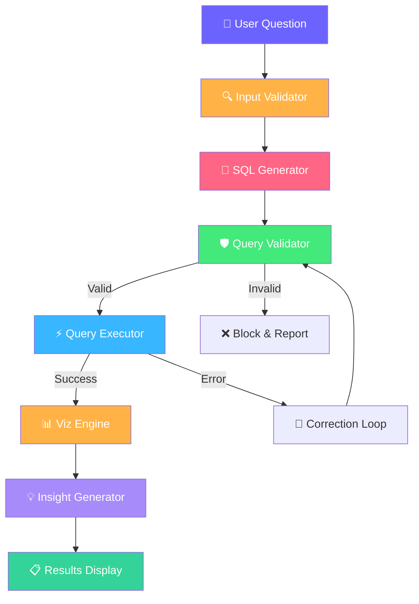

# 🔮 AskDataSage AI

**AI-Powered Data Insights Assistant** — Ask questions about your data in plain English, get SQL queries, interactive visualizations, and business insights instantly.


---

## 🎯 What It Does

AskDataSage AI transforms natural language questions into actionable data insights through an intelligent pipeline:

```
User Question → SQL Generation → Safety Validation → Execution → Visualization → Business Insight
```

### Key Features

- **🧠 Natural Language to SQL** — Powered by Groq LLM (Llama 3.3 70B)
- **🛡️ Query Safety Layer** — Only SELECT queries allowed; blocks dangerous operations
- **🔧 Auto-Correction** — Failed queries are automatically fixed and retried
- **📊 Smart Visualizations** — Rule-based chart selection (bar, line, histogram, pie, scatter)
- **💡 Business Insights** — LLM-generated analysis highlighting trends and patterns
- **💬 Conversation Memory** — Supports follow-up questions with context
- **⚡ Caching** — Repeat queries served instantly without LLM calls
- **⏱️ Timeout Protection** — SQL and LLM calls bounded to prevent hangs
- **📥 CSV Export** — Download results with one click
- **🎨 Premium Dark UI** — Modern Streamlit interface with glassmorphism styling

---

## 🏗️ Architecture



### Project Structure

```
AskDataSage AI/
├── streamlit_app.py          # Streamlit entry point
├── src/
│   ├── sql_generator.py      # LLM → SQL conversion + correction + caching
│   ├── query_validator.py    # Safety validation (SELECT-only)
│   ├── query_executor.py     # SQLite execution → DataFrame + timeout
│   ├── viz_engine.py         # Rule-based Plotly charts
│   ├── insight_generator.py  # LLM business insights + SQL explanation + caching
│   ├── input_validator.py    # User input validation
│   ├── memory.py             # Conversational memory
│   └── logger.py             # Structured logging with rotation
├── data/
│   ├── generate_data.py      # Database seed script
│   └── ecommerce.db          # SQLite database (generated)
├── .env                      # API key configuration
├── .streamlit/config.toml    # Theme configuration
└── requirements.txt          # Python dependencies
```

---

## 🚀 Setup

### 1. Clone & Install

```bash
cd "AskDataSage AI"
pip3 install -r requirements.txt
```

### 2. Configure API Key

Get a free API key from [console.groq.com](https://console.groq.com), then create `.env`:

```env
GROQ_API_KEY=gsk_your_actual_key_here
```

### 3. Generate Database

```bash
python3 data/generate_data.py
```

This creates a realistic e-commerce database with:
- 500 users across 30 cities
- 200 products in 7 categories
- 5,000 orders spanning 2 years
- ~10,000 order line items

### 4. Launch

```bash
python3 -m streamlit run streamlit_app.py
```

---

## 💡 Example Queries

| Query | What You Get |
|-------|-------------|
| "Top 5 best-selling products" | Ranked bar chart + sales numbers |
| "Revenue by category" | Category breakdown with percentages |
| "Monthly order trends" | Time-series line chart |
| "Average order value by city" | City comparison with insights |
| "Top 10 customers by spending" | Customer lifetime value analysis |
| "Order status distribution" | Pie chart + status breakdown |
| "Show electronics products under $50" | Filtered product table |
| "Compare Q1 vs Q2 revenue" | Quarterly comparison |

---

## 🛡️ Safety

- **SELECT-only** — All write operations are blocked at the validation layer
- **Read-only DB** — Database connections use SQLite read-only mode
- **Keyword blocking** — DROP, DELETE, UPDATE, INSERT, ALTER, and 10+ more keywords are rejected
- **Comment blocking** — SQL comments are blocked to prevent injection
- **Single-statement only** — Multiple statements separated by semicolons are rejected
- **Input validation** — Irrelevant inputs and code requests are rejected before reaching the LLM
- **Timeout protection** — SQL queries (10s) and LLM calls (30s) are bounded

---

## 🔧 Tech Stack

| Component | Technology | Purpose |
|-----------|-----------|---------|
| LLM | Groq API (Llama 3.3 70B) | SQL generation + insights |
| Database | SQLite | Data storage & querying |
| Data Processing | Pandas | DataFrame operations |
| Visualization | Plotly | Interactive charts |
| UI Framework | Streamlit | Web application |
| Validation | Regex-based | Query & input safety |
| Data Generation | Faker | Realistic test data |
